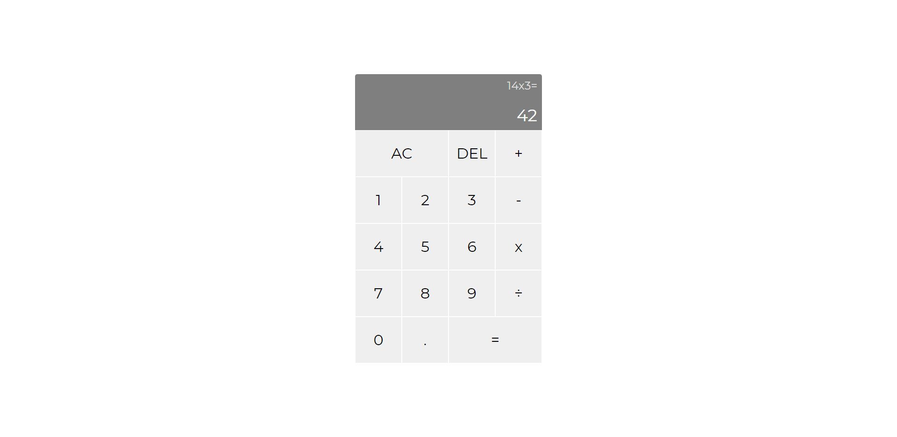

## JavaScript Calculator

- Live Demo: https://fluttershysux.github.io/Calculator/

### The Project

- The aim of this project was to create a functional calculator using JavaScript

### Features

- Evaluate expressions using add, subtract, multiply and divide
- String together several operations to get the right answer e.g. 12 + 7 - 5 * 3 = 42 
- Clear button
- Undo button
- Floating point numbers
- Full keyboard support

